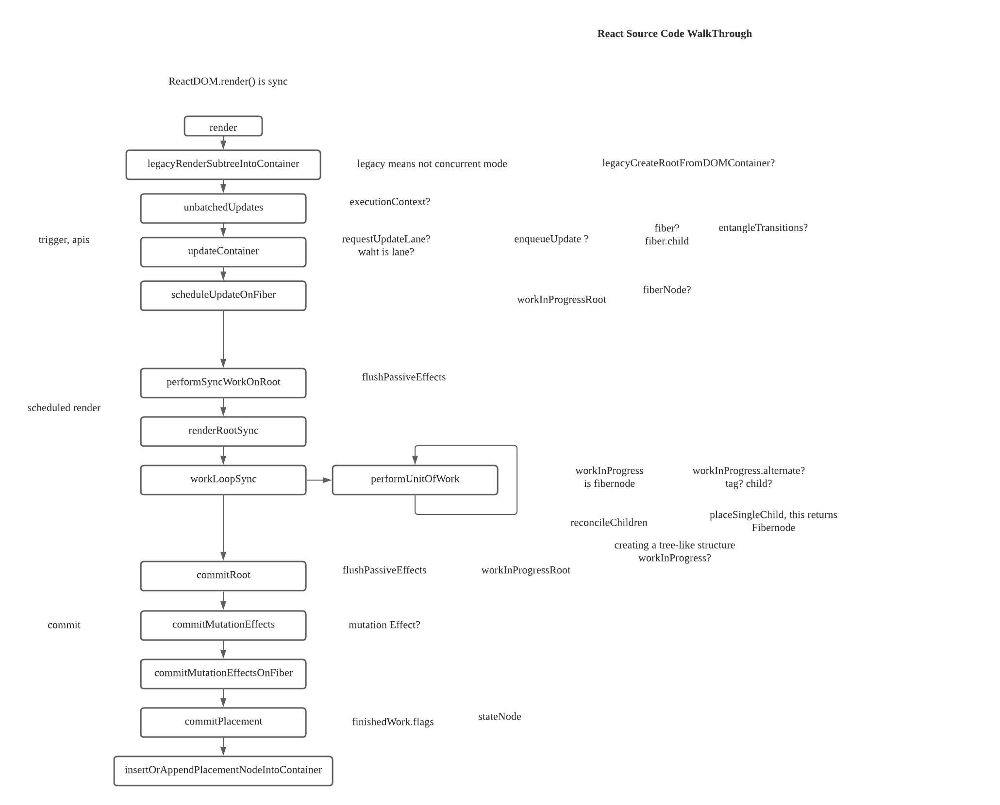

- 


Great question! Let's break this down in steps and explain the timing of React's lifecycle, focusing on why `useEffect` and `useLayoutEffect` cannot be used to run a custom constructor-like logic.

### React Component Rendering and Hooks Timing

1. **Component Initialization**: 
   When a component mounts (renders for the first time), React calls the functional component to build the virtual DOM. During this, it sets up all the internal states, hooks (like `useState`, `useEffect`, etc.), and prepares for the actual DOM update.

2. **Rendering Phase**:
   The rendering phase occurs when React computes the new DOM elements based on the component's return value (e.g., JSX) but **does not actually modify the DOM yet**.

3. **Commit Phase**:
   Once the virtual DOM is ready, React commits the changes to the actual DOM. After this, React calls any side effects, such as `useEffect` and `useLayoutEffect`.

### `useEffect` vs `useLayoutEffect`

#### `useEffect`

- **Runs After the DOM is painted**: `useEffect` is called **after the DOM is updated** and the browser has painted the screen.
- **Asynchronous**: It runs asynchronously and **does not block the browser’s paint**.
- **Purpose**: It's used for side effects that don't need to block rendering, such as fetching data, event listeners, or logging. The browser has already updated the DOM by the time `useEffect` runs.

#### `useLayoutEffect`

- **Runs Before the DOM is painted**: `useLayoutEffect` is triggered **after the DOM updates but before the browser paints** the screen.
- **Synchronous**: It blocks the browser’s paint until the effect is finished.
- **Purpose**: This hook is ideal when you need to measure the layout (e.g., reading dimensions of elements) or do DOM manipulations before the screen update.

#### **When do `useEffect` and `useLayoutEffect` run during the mounting process?**
1. **Mounting Phase**:
   - First, the component is rendered and committed to the DOM.
   - **`useLayoutEffect` runs** immediately after React commits the changes to the DOM but **before the browser paints** the screen. Any changes made inside `useLayoutEffect` will be applied before the user sees anything.
   - **`useEffect` runs** after the browser has painted the updated DOM and the user can see the changes.

2. **Updating Phase**:
   - Similar timing as the mounting phase. First, React renders and commits changes to the DOM.
   - `useLayoutEffect` runs synchronously before the browser paints.
   - `useEffect` runs after the DOM is updated and painted.

### Why Can't You Use `useConstructor` in `useEffect` or `useLayoutEffect`?

If you're trying to implement something like a constructor in a React component, you need it to run **during the initial rendering phase**, before `useEffect` or `useLayoutEffect` run.

- **`useEffect` runs too late**: Since `useEffect` runs after the initial paint, it’s too late to act like a constructor. At this point, the component has already rendered once.
- **`useLayoutEffect` runs synchronously, but after the DOM is updated**: This is also too late for a "constructor" logic, since the DOM has already been modified and the effect only fires after the rendering happens.

### Where to Run "Constructor" Logic?

If you need to run setup code during the component initialization, before the render occurs, here are your options:

1. **Directly Inside the Component Function**: 
   Any logic you want to behave like a constructor should run at the top level inside the component function, outside any hook like `useEffect` or `useLayoutEffect`. This code is executed during the render phase, before React commits to the DOM.

   Example:

   ```jsx
   const MyComponent = () => {
     // Constructor-like logic
     const someValue = useConstructor();  // This runs before the DOM updates

     useEffect(() => {
       // This runs after the DOM is updated and painted
     }, []);

     useLayoutEffect(() => {
       // This runs after the DOM is updated but before the paint
     }, []);

     return <div>{someValue}</div>;
   };
   ```

   Here, `useConstructor` will be executed synchronously during the rendering phase, so it behaves like a constructor and can initialize state or perform calculations before any effects are run.

2. **Using `useState` for Initialization**: 
   If your constructor-like logic involves setting up initial state, `useState` can also serve this purpose because it only initializes once when the component first renders:

   ```jsx
   const MyComponent = () => {
     const [state, setState] = useState(() => {
       return initializeConstructor();  // Constructor logic here
     });

     return <div>{state}</div>;
   };
   ```

   This way, the initialization happens before the component renders, similar to how a constructor works in class-based components.

### Conclusion

- **`useEffect` and `useLayoutEffect` run after the render process**, either before or after the DOM paint, which is too late to act like a constructor.
- **Constructor-like logic** needs to run synchronously during the render phase, which is why it should be executed inside the main component body or within a state initializer.
- **`useLayoutEffect`** is for DOM-related actions that need to run before the paint, while **`useEffect`** is for side effects after the DOM has been rendered and painted.

I hope this clears up why `useConstructor` needs to be placed directly inside the component, and how `useEffect` and `useLayoutEffect` fit into the rendering process! Let me know if you need more details or further examples.